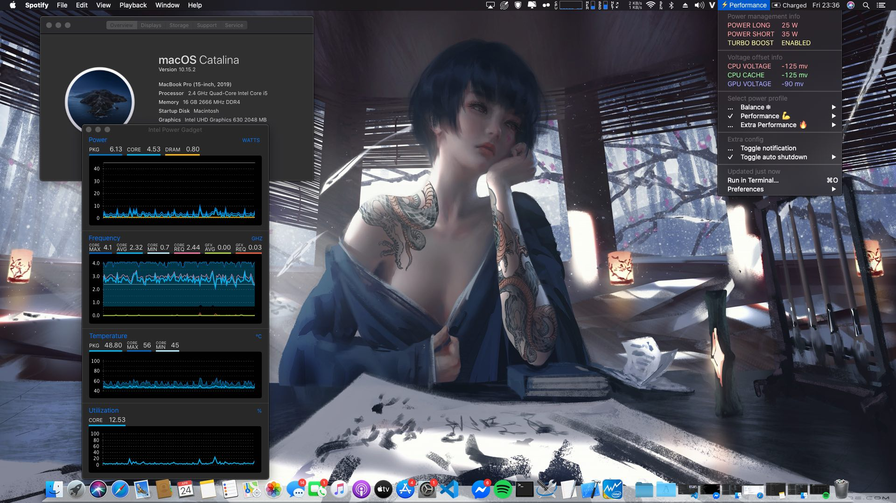

# Dell Inspiron 759x

<p>
    
</p>

## Configuration

| Model     | MacBookPro15,3               | Version        | 10.15.2             |
| :-------- | :--------------------------- | :------------- | :------------------ |
| Processor | Intel Core i5-9300H/i7-9750H | Graphics       | UHD Graphics 630    |
| Memory    | 2667MHz DDR4 8GB x2          | Disk           | Samsung 970 EVO     |
| Audio     | Realtek ALC295               | WiFi/Bluetooth | Dell Wireless 1820a |

### Not Working

- Intel card not working yet (Bluetooth kext can be found at [IntelBluetoothFirmware](https://github.com/zxystd/IntelBluetoothFirmware))
- Discrete GPU (Disabled)
- Fingerprint (Disabled)

## For building

> This will pull all newest kext and build into zip files

- Clone this repo
- Run follow command: `python3 update.py --build`

## Installation

- Prepair an Mac installer in USB with bootloader you choice ( Use unibeast to create it )
- Replace EFI/(Booloader) folder in USB EFI partition with this shipped bootloader folder
  - If you dont have EFI folder, go to bootloader download pages and take them
- Boot into USB and select MacOs installer
- After install success, run PostInstall/install.sh in terminal
- Then you need to mount EFI partition and replace it with USB's EFI
- After System EFI replaced by your EFI, Using Opencore Configurator, Clover Configurator or update script to change SMBIOS, generate your serial and MBL
- Run `python3 update.py --post` to fix sleep and audio

  - You can run `bash install.sh` in PostInstall/CombojackFix if cant use above script

- If you're using intel card, please use NullEthernet for fixing iMess and FaceTime
  - Change MAC in NullEthernet with your new created one, see below

### Fake ethernet

- Generate your MAC address in SSDT-RMNE if using NullEthernet
- You can make an MacAddress in [Mac generator online](https://www.browserling.com/tools/random-mac)
- Edit SSDT-RMNE.aml with MaciASL and replace MAC with your generated one
- Save as -> ACPI machine language (replace exited one)
- Add it to your bootloader:
  - Kext add in Kexts (Opencore need add to Kernel in config.plist)
  - AML's file add to ACPI folder (Opencore need add to ACPI)
- Reboot

### Sleep Wake

```shell
sudo pmset -a hibernatemode 0
sudo pmset -a autopoweroff 0
sudo pmset -a standby 0
sudo pmset -a proximitywake 0
sudo pmset -b tcpkeepalive 0 (optional)
```

> `-b` - Battery `-c` - AC Power `-a` - Both

Please uncheck all options (except `Prevent computer from sleeping...`, which is optional) in the `Energy Saver` panel.

### SN MLB SmUUID using update script

Please use your own SN, MLB (use [MacInfoPkg](https://github.com/acidanthera/MacInfoPkg) or Clover Configurator or [Hackintool](https://www.tonymacx86.com/threads/release-hackintool-v2-8-6.254559/)) and SmUUID.

```sh
python update.py --set sn=xxx mlb=yyy smuuid=zzz
python update.py --gen # generate and use new SN, MLB and SmUUID
```

### Display

If you are using FHD(1080p) display, you may want to enable font smoothing:

```
defaults write -g CGFontRenderingFontSmoothingDisabled -bool NO
```

If your laptop display is 4K screen, you should set uiscale to :

```sh
python update.py --set uiscale=2
```

### DW1820a

You have to add following config to Device Properties:

> Change

```xml
<key>#PciRoot(0x0)/Pci(0x1c,0x0)/Pci(0x0,0x0)</key>
```

> Into

```xml
<key>PciRoot(0x0)/Pci(0x1c,0x0)/Pci(0x0,0x0)</key>
```

See [THE Solution:Dell DW1820A](https://www.tonymacx86.com/threads/the-solution-dell-dw1820a-broadcom-bcm94350zae-macos-15.288026/)

### CLOVER and Opencore Theme

You can set theme to one of these [themes](https://sourceforge.net/p/cloverefiboot/themes/ci/master/tree/themes/).

Opencore now can be using clover theme by convert function in update.py, run below to set and theme you like

- Right now opencore only have white font color, so select dark theme is best choice

```sh
python update.py --set theme=name # will download if not exist
```

- Example `python3 update.py --set theme=Material`

### NTFS Writing

Add `UUID=xxx none ntfs rw,auto,nobrowse` to `/etc/fstab`, **xxx** is the UUID of your NTFS partition.

If your NTFS partition has Windows installed, you need to run `powercfg -h off` in powershell in Windows to disable hibernation.

### Tap Delay

- Turn off `Enable dragging` or use `three finger drag` to avoid one-finger tap delay.
- Turn off `Smart zoom` to avoid two-finger tap delay.

See [is-it-possible-to-get-rid-of-the-delay-between-right-clicking-and-seeing-the-context-menu](https://apple.stackexchange.com/a/218181)

## Credits

- [acidanthera](https://github.com/acidanthera) for providing almost all kexts and drivers
- [alexandred](https://github.com/alexandred) for providing VoodooI2C
- [headkaze](https://github.com/headkaze) for providing the very useful [Hackintool](https://www.tonymacx86.com/threads/release-hackintool-v2-8-6.254559/)
- [daliansky](https://github.com/daliansky) for providing the awesome hotpatch guide [OC-little](https://github.com/daliansky/OC-little/) and the always up-to-date hackintosh solutions [XiaoMi-Pro-Hackintosh](https://github.com/daliansky/XiaoMi-Pro-Hackintosh) [黑果小兵的部落阁](https://blog.daliansky.net/)
- [RehabMan](https://github.com/RehabMan) for providing numbers of [hotpatches](https://github.com/RehabMan/OS-X-Clover-Laptop-Config/tree/master/hotpatch) and hotpatch guides
- [knnspeed](https://www.tonymacx86.com/threads/guide-dell-xps-15-9560-4k-touch-1tb-ssd-32gb-ram-100-adobergb.224486) for providing Combojack, well-explained hot patches and USB-C hotplug solution
- [bavariancake](https://github.com/bavariancake/XPS9570-macOS) and [LuletterSoul](https://github.com/LuletterSoul/Dell-XPS-15-9570-macOS-Mojave) for providing detailed installation guide and configuration for XPS15-9570
- And all other authors that mentioned or not mentioned in this repo
- [xxxza](https://github.com/xxxzc/xps15-9570-macos) this build is porter from his project, big thanks to him
