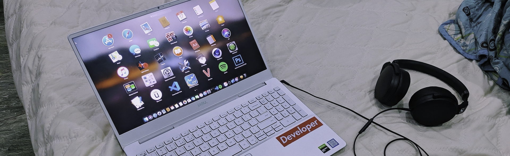
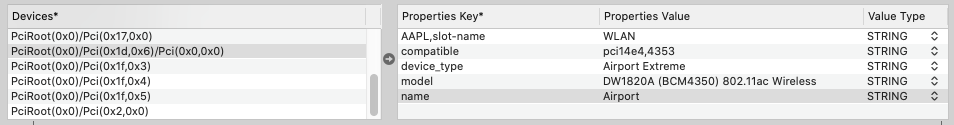
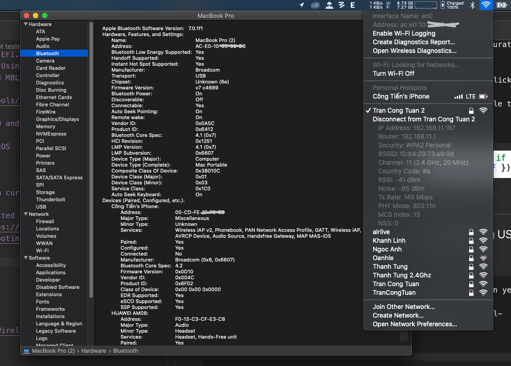

# Dell Inspiron 7591

- This build running on MacOs X
- Currently opencore tested in 10.14.6, 10.15.2

<p>
    
</p>

# I. Detail

    Version:    4.5
    Date:       28/01/2020
    Support:    All BIOS
    Changelogs:
        - Fix boot to catalina due to ECDV devices in DSDT
        - Update VoodooPS2 to lastest
    Status: Stable

### <strong>Important</strong>:

- Disable auto power up on lid in BIOS, if not you will get black screen on wake up by lid. Thanks @magonzalez112

### <strong>For 4k screen</strong>:

- Goto Config.plist -> DeviceProperties -> Add -> PciRoot(0x0)/Pci(0x2,0x0)
- Change dpcd-max-link-rate = <14000000>

# II. System specification

    1.Name:           Dell Inspiron 7591
    2.CPU:            Intel Core i5-9300H
    3.Graphic:        Intel UHD630
    4.Wifi/B:         Replaced with DW1820a
    5.Card Reader:    Realtek Memory Card Reader
    6.Camera:         DELL UVC HD
    7.Audio:          ALC295!
    8.Touchpad:       ELAN I2C ( Dell Precision Trackpad )
    9.Bios Version:   1.5.1

# III. Thing will not able to use

    1. DGPU Nvidia 1050 (Disabled through ssdt)
    2. Fingerprint (Disabled through usb inject)
    3. Intel wifi card

# IV. Tested hardware

    + Speaker/Headphone work
    + Linein through headset work
    + Type C USB work (Thunderbolt not tested yet)
    + Type C Graphic output work
    + HDMI work (With audio if boot with pluged HDMI)
    + All usb port work
    + SD card reader work
    + Camera work
    + Trackpad smooth as F
    + Battery work
    + All function key expect above numpad work
    + Keyboard and numpad work normal
    + UHD630 work

# V. Benchmark

    + Cinebench R20: MC - 1810
    + Geekbench 5: MC - 4158, SC - 1031

# VI. Know problems

    1. Internal mic (Pls help me if you master of AppleHDA, other linux it dead too)
    2. HDMI audio ( Worked if boot with HDMI pluged )
    2. Audio sometime not working if mac installed in fast NVME drive, due to AppleALC bug (Testing with some fix...)

# VII. Important thing

    > All kext below should be updated from my git for this laptop:
        + AppleALC.kext ( Verb changed to support ALC295 in 7591, layout 13 modified to work with combojack )
            > Find it here: https://github.com/tctien342/AppleALC
            > Find Combojack here: https://github.com/tctien342/ComboJack
        + CustomPeripheral.kext ( Fake apple device, change it if you have different devices )
        + CPUFriendDataProvider.kext is for my 9300H, maybe it different for you, using https://github.com/stevezhengshiqi/one-key-cpufriend to regenerate it if your cpu is different.

    > After update or install MacOS: Please run rebuilt your kext ( Using Kext Utility or something can handle it ) for stablity.

# VIII. Step to install

    1. Prepair an Mac installer in USB with Opencore added ( Use unibeast to create it )
    2. Replace EFI folder in USB EFI partition with this shipped EFI folder
    3. Boot into USB and select MacOs installer
    4. After install success, boot into MacOS, run ComboJack Alc295/ComboJack_Installer/install.sh in terminal
    5. Use Kext Utility to rebuild kext then reboot
    6. Then you need to mount EFI partition and replace it with shipped EFI
    8. After System EFI replaced by your EFI, Using Opencore Configurator to change SMBIOS, generate your serial and MBL
    9. Optional to fix iMessenger if you dont have compatible wifi card
        + Go to https://www.browserling.com/tools/random-mac an click GenerateIP and pick an Mac address
        + Put it into SSDT-RMNE.dsl in fake ethernet like below and save as aml file then copy to ACPI folder in OC
        + Copy NullEthernet.kext into your OC->Kexts
        + Add it into Configs.plist->Kernel->Add
        > Login iCloud and iMessenger, enjoy MacOS

<p>
    
</p>

# IX. WIFI Replacement

## Using new card ( DW1820A tested)

### Using DW1820a

    + Mine is CN-0VW3T3 0x106B:0x0021, not tested in other verizon yet
    + You need masked your pin like this: https://osxlatitude.com/forums/topic/11540-dw1820a-the-general-troubleshooting-thread/?do=findComment&comment=91179
    + Add flag below into boot flag (config.plist->NVRAM->7C436110-AB2A-4BBB-A880-FE41995C9F82->boot-args)
    + Add Devices below into config.plist -> DeviceProperties -> Devices

```
    + PciRoot(0x0)/Pci(0x1d,0x6)/Pci(0x0,0x0)
        > AAPL,slot-name: WLAN
        > compatible: pci14e4,4353
        > device_type: Airport Extreme
        > model: DW1820A (BCM4350) 802.11ac Wireless
        > name: Airport
```

<p align="center">
    
</p>

    + Add kext to opencore and enabled it in config.plist->kernel:
        + AirportBrcmFixup.kext
        + BrcmBluetoothInjector.kext
        + BrcmFirmwareData.kext
        + BrcmPatchRAM3.kext
        + BT4LEContinuityFixup.kext (Handoff fix? maybe)

```rb
    brcmfx-driver=2 brcmfx-country=#a #(wifi fix)
```

<p>
    
</p>

    <> Other support card like DW1560 and DW1830 you can google and test it, much easy than DW1820A

## Using usb wifi

    + Suggest Comfast cf-811ac
    + Using https://github.com/chris1111/USB-Wireless-Utility to make it run in mojave and catalina

# X. Undervolt script

    +Too f**king hot?
    > Go here: https://github.com/tctien342/smart-cpu

# Thanks

    + @bavariancake [https://github.com/bavariancake/XPS9570-macOS]
    + @sicreative [https://github.com/sicreative/VoltageShift]
    + @hackintosh-stuff [https://github.com/hackintosh-stuff/ComboJack]
    + @LuletterSoul [https://github.com/LuletterSoul/Dell-XPS-15-9570-macOS-Mojave]
    + @chris1111 [https://github.com/chris1111/USB-Wireless-Utility]
